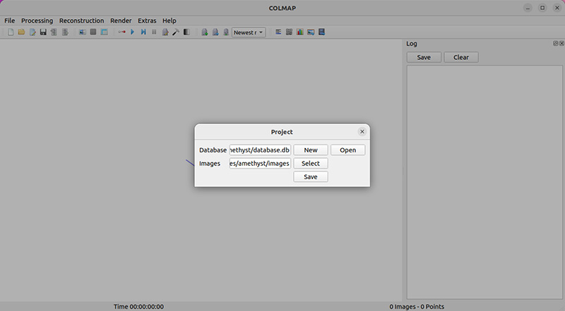

# 3D Gaussian Splatting for Real-Time Radiance Field Rendering


## What are 3D Gaussian Splats?
- At a high level, 3D Gaussian splats, like NeRFs or photogrammetry methods, are a way to create a 3D scene using a set of 2D images. Practically, this means that all you need is a video or a set of photos of a scene, to obtain a 3D representation of it — enabling you to reshoot it, or render it from any angle.

Step-by-step Tutorial:

## Cloning the Repository: 

	#HTTPS
	git clone https://github.com/graphdeco-inria/gaussian-splatting --recursive

## Optimizer

### Hardware Requirements

- CUDA-ready GPU with Compute Capability 7.0+
- 24 GB VRAM (to train to paper evaluation quality)
- Please see FAQ for smaller VRAM configurations

### Software Requirements
- Conda (recommended for easy setup)
- C++ Compiler for PyTorch extensions (we used Visual Studio 2019 for Windows)
- CUDA SDK 11 for PyTorch extensions, install *after* Visual Studio (we used 11.8, **known issues with 11.6**)
- C++ Compiler and CUDA SDK must be compatible
   				
## Setup
Do local Setup using following commands :

	SET DISTUTILS_USE_SDK=1 # Windows only
	conda env create --file environment.yml
	conda activate gaussian_splatting

Please note that this process assumes that you have CUDA SDK 11 installed, not 12. For modifications, see below.

## Running 
To run the optimizer, simply use following commands:
	
	python train.py -s <path to COLMAP or NeRF Synthetic dataset>

<details><summary>Command Line Arguments for train.py</summary> 

  #### --source_path / -s
  Path to the source directory containing a COLMAP or Synthetic NeRF data set.
  #### --model_path / -m 
  Path where the trained model should be stored (```output/<random>``` by default).
  #### --images / -i
  Alternative subdirectory for COLMAP images (```images``` by default).
  #### --eval
  Add this flag to use a MipNeRF360-style training/test split for evaluation.
  </details>

## Evaluation

By default, the trained models use all available images in the dataset. To train them while withholding a test set for evaluation, use the --eval flag.     
This way, you can render training/test sets and produce error metrics as follows:

	python train.py -s <path to COLMAP or NeRF Synthetic dataset> --eval # Train with train/test split
	python render.py -m <path to trained model> # Generate renderings
	python metrics.py -m <path to trained model> # Compute error metrics on renderings
<details>
<summary><span style="font-weight: bold;">Command Line Arguments for render.py</span></summary>

  #### --model_path / -m 
  Path to the trained model directory you want to create renderings for.
  #### --skip_train
  Flag to skip rendering the training set.
  #### --skip_test
  Flag to skip rendering the test set.
  #### --quiet 
  Flag to omit any text written to standard out pipe. 

  **The below parameters will be read automatically from the model path, based on what was used for training. However, you may override them by providing them explicitly on the command line.** 

  #### --source_path / -s
  Path to the source directory containing a COLMAP or Synthetic NeRF data set.
  #### --images / -i
  Alternative subdirectory for COLMAP images (```images``` by default).
  #### --eval
  Add this flag to use a MipNeRF360-style training/test split for evaluation.
  #### --resolution / -r
  Changes the resolution of the loaded images before training. If provided ```1, 2, 4``` or ```8```, uses original, 1/2, 1/4 or 1/8 resolution, respectively. For all other values, rescales the width to the given number while maintaining image aspect. ```1``` by default.
  #### --white_background / -w
  Add this flag to use white background instead of black (default), e.g., for evaluation of NeRF Synthetic dataset.
  #### --convert_SHs_python
  Flag to make pipeline render with computed SHs from PyTorch instead of ours.
  #### --convert_cov3D_python
  Flag to make pipeline render with computed 3D covariance from PyTorch instead of ours.

</details>

<details>
<summary><span style="font-weight: bold;">Command Line Arguments for metrics.py</span></summary>

  #### --model_paths / -m 
  Space-separated list of model paths for which metrics should be computed.
</details>

## Interactive Viewers
We provide two interactive viewers for our method: remote and real-time. Our viewing solutions are based on the [SIBR](https://sibr.gitlabpages.inria.fr/) framework, developed by the GRAPHDECO group for several novel-view synthesis projects.

### Hardware Requirements
- OpenGL 4.5-ready GPU and drivers (or latest MESA software)
- 4 GB VRAM recommended
- CUDA-ready GPU with Compute Capability 7.0+ (only for Real-Time Viewer)

### Software Requirements
- Visual Studio or g++, **not Clang** (we used Visual Studio 2019 for Windows)
- CUDA SDK 11, install *after* Visual Studio (we used 11.8)
- CMake (recent version, we used 3.24)
- 7zip (only on Windows)

### Pre-built Windows Binaries
We provide pre-built binaries for Windows [here](https://repo-sam.inria.fr/fungraph/3d-gaussian-splatting/binaries/viewers.zip). We recommend using them on Windows for an efficient setup, since the building of SIBR involves several external dependencies that must be downloaded and compiled on-the-fly.

### Installation from Source
If you cloned with submodules (e.g., using ```--recursive```), the source code for the viewers is found in ```SIBR_viewers```. The network viewer runs within the SIBR framework for Image-based Rendering applications.

#### Windows
CMake should take care of your dependencies.
```shell
cd SIBR_viewers
cmake -Bbuild .
cmake --build build --target install --config RelWithDebInfo
```
You may specify a different configuration, e.g. ```Debug``` if you need more control during development.

#### Ubuntu 22.04
You will need to install a few dependencies before running the project setup.
```shell
# Dependencies
sudo apt install -y libglew-dev libassimp-dev libboost-all-dev libgtk-3-dev libopencv-dev libglfw3-dev libavdevice-dev libavcodec-dev libeigen3-dev libxxf86vm-dev libembree-dev
# Project setup
cd SIBR_viewers
cmake -Bbuild . -DCMAKE_BUILD_TYPE=Release # add -G Ninja to build faster
cmake --build build -j24 --target install
``` 

#### Ubuntu 20.04
Backwards compatibility with Focal Fossa is not fully tested, but building SIBR with CMake should still work after invoking
```shell
git checkout fossa_compatibility
```

### Navigation in SIBR Viewers
The SIBR interface provides several methods of navigating the scene. By default, you will be started with an FPS navigator, which you can control with ```W, A, S, D, Q, E``` for camera translation and ```I, K, J, L, U, O``` for rotation. Alternatively, you may want to use a Trackball-style navigator (select from the floating menu). You can also snap to a camera from the data set with the ```Snap to``` button or find the closest camera with ```Snap to closest```. The floating menues also allow you to change the navigation speed. You can use the ```Scaling Modifier``` to control the size of the displayed Gaussians, or show the initial point cloud.

### Running the Network Viewer


https://github.com/graphdeco-inria/gaussian-splatting/assets/40643808/90a2e4d3-cf2e-4633-b35f-bfe284e28ff7


After extracting or installing the viewers, you may run the compiled ```SIBR_remoteGaussian_app[_config]``` app in ```<SIBR install dir>/bin```, e.g.: 
```shell
./<SIBR install dir>/bin/SIBR_remoteGaussian_app
```
The network viewer allows you to connect to a running training process on the same or a different machine. If you are training on the same machine and OS, no command line parameters should be required: the optimizer communicates the location of the training data to the network viewer. By default, optimizer and network viewer will try to establish a connection on **localhost** on port **6009**. You can change this behavior by providing matching ```--ip``` and ```--port``` parameters to both the optimizer and the network viewer. If for some reason the path used by the optimizer to find the training data is not reachable by the network viewer (e.g., due to them running on different (virtual) machines), you may specify an override location to the viewer by using ```-s <source path>```. 

<details>
<summary><span style="font-weight: bold;">Primary Command Line Arguments for Network Viewer</span></summary>

  #### --path / -s
  Argument to override model's path to source dataset.
  #### --ip
  IP to use for connection to a running training script.
  #### --port
  Port to use for connection to a running training script. 
  #### --rendering-size 
  Takes two space separated numbers to define the resolution at which network rendering occurs, ```1200``` width by default.
  Note that to enforce an aspect that differs from the input images, you need ```--force-aspect-ratio``` too.
  #### --load_images
  Flag to load source dataset images to be displayed in the top view for each camera.
</details>
<br>

### Running the Real-Time Viewer


https://github.com/graphdeco-inria/gaussian-splatting/assets/40643808/0940547f-1d82-4c2f-a616-44eabbf0f816


After extracting or installing the viewers, you may run the compiled ```SIBR_gaussianViewer_app[_config]``` app in ```<SIBR install dir>/bin```, e.g.: 
```shell
./<SIBR install dir>/bin/SIBR_gaussianViewer_app -m <path to trained model>
```

It should suffice to provide the ```-m``` parameter pointing to a trained model directory. Alternatively, you can specify an override location for training input data using ```-s```. To use a specific resolution other than the auto-chosen one, specify ```--rendering-size <width> <height>```. Combine it with ```--force-aspect-ratio``` if you want the exact resolution and don't mind image distortion. 

**To unlock the full frame rate, please disable V-Sync on your machine and also in the application (Menu &rarr; Display). In a multi-GPU system (e.g., laptop) your OpenGL/Display GPU should be the same as your CUDA GPU (e.g., by setting the application's GPU preference on Windows, see below) for maximum performance.**


In addition to the intial point cloud and the splats, you also have the option to visualize the Gaussians by rendering them as ellipsoids from the floating menu.
SIBR has many other functionalities, please see the [documentation](https://sibr.gitlabpages.inria.fr/) for more details on the viewer, navigation options etc. There is also a Top View (available from the menu) that shows the placement of the input cameras and the original SfM point cloud; please note that Top View slows rendering when enabled. The real-time viewer also uses slightly more aggressive, fast culling, which can be toggled in the floating menu. If you ever encounter an issue that can be solved by turning fast culling off, please let us know.

<details>
<summary><span style="font-weight: bold;">Primary Command Line Arguments for Real-Time Viewer</span></summary>

  #### --model-path / -m
  Path to trained model.
  #### --iteration
  Specifies which of state to load if multiple are available. Defaults to latest available iteration.
  #### --path / -s
  Argument to override model's path to source dataset.
  #### --rendering-size 
  Takes two space separated numbers to define the resolution at which real-time rendering occurs, ```1200``` width by default. Note that to enforce an aspect that differs from the input images, you need ```--force-aspect-ratio``` too.
  #### --load_images
  Flag to load source dataset images to be displayed in the top view for each camera.
  #### --device
  Index of CUDA device to use for rasterization if multiple are available, ```0``` by default.
  #### --no_interop
  Disables CUDA/GL interop forcibly. Use on systems that may not behave according to spec (e.g., WSL2 with MESA GL 4.5 software rendering).
</details>
<br>


# How to train your own models? (Tutorial)

## Important: 
before starting, Make sure that You have completed the above steps. 
In particular, this will require a CUDA-ready GPU with 24 GB of VRAM.

## Step 1: Record the scene

Recording the scene is one of the most important steps because that's what the model will be trained on. You can either record a video (and extract the frames afterwards) or take individual photos. Be sure to move around the scene, and to capture it from different angles. Generally, the more images you have, the better the model will be. 
A few tips to keep in mind to get the best results:

- Avoid moving too fast, as it can cause blurry frames (which 3D Gaussian Splats will try to reproduce)
- Try to aim for 200-1000 images. Less than 200 images will result in a low quality model, and more than 1000 images will take a long time to process in step 2.
- Lock the exposure of your camera. If it's not consistent between frames, it will cause flickering in the final model.

Once you're done. Place your images in a folder called input, like this:

```
📦 $FOLDER_PATH
|---📂 input
    |---📜 <image 0>
    |---📜 <image 1>
    |---📜 ...
```

## Step 2: Obtain Camera poses

Obtaining camera poses is probably to most finicky step of the entire process, for inexperienced users. The goal is to obtain the position and orientation of the camera for each frame. This is called the camera pose. There are several ways to do so:

- Use COLMAP. COLMAP is a free and open-source Structure-from-Motion (SfM) software. It will take your images as input, and output the camera poses. It comes with a GUI and is available on Windows,Mac, and Linux.

## Installation of colmap : 
go to the following link for installtion of colmap 

	https://colmap.github.io/install.html

## After installed the colmap,

- Open COLMAP GUI. On linux, you can run colmap gui in a terminal. On Windows and Mac, you can open the COLMAPapplication.
- Start a new project by clicking on File > New project. A dialog opens up. Create a new database by clicking on New and calling it database.db.For Images, select the folder where your images are located. Then click on Save.

- Run Feature extraction by clicking on Processing > Feature extraction. Keep most parameters as default. Check the "Shared for all images" options (if you didn't zoom in or out between frames), and set first_octave to 0 (this will be faster than with the default -1). Then click on Extract (this will take a few seconds).
- Run Feature matching by clicking on Processing > Feature matching. Because you have recorded the object by walking around it, neighboring images should be close in space, so you can use the Sequential matching mode. This will be faster than the default Exhaustive mode (if reconstruction fails, you can try again with Exhaustive). Then click on Run (this will take a few seconds to a minute).
- Now comes the last step: Reconstruction. This will take the longest (from a few minutes to a few hours depending on the number of images). First, click on Reconstruction > Reconstruction options. Uncheck multiple_models (since we're reconstructing a single scene) and close the window. Then start the reconstruction optimization by clicking on Reconstruction > Start reconstruction.
- Once COLMAP has finished, you will see the camera poses in the GUI (in red) along with a sparse pointcloud of the scene. Now export the camera poses by clicking on File > Export model and save it in a folder distorted at the same level as the input folder. You can now close COLMAP.

## The folder structure of your model dataset should now look like this:
```
📦 $FOLDER_PATH
 |---📂 input
 |---📂 distorted
 |---📂 0
      |---📜 points3D.bin
      |---📜 images.bin
      |---📜 cameras.bin
```
## run the following script:
			python convert.py -s $FOLDER_PATH --skip_matching

The folder structure of your model dataset should now look like this:

📦 $FOLDER_PATH
 ┣ 📂 (input)
 ┣ 📂 (distorted)
 ┣ 📂 images
 ┣ 📂 sparse
 ┃ ┣ 📂 0
 ┃ ┃ ┣ 📜 points3D.bin
 ┃ ┃ ┣ 📜 images.bin
 ┃ ┃ ┗ 📜 cameras.bin

## Step 3: Train the 3D Gaussian Splatting model

				python train.py -s $FOLDER_PATH -m $FOLDER_PATH/output

This will save the model in the $FOLDER_PATH/output folder.

## Step 4: Visualize the model
 
The folder structure of your model dataset should now look like this:

📦 $FOLDER_PATH
 ┣ 📂 images
 ┣ 📂 sparse
 ┣ 📂 output
 ┃ ┣ 📜 cameras.json
 ┃ ┣ 📜 cfg_args
 ┃ ┗ 📜 input.ply
 ┃ ┣ 📂 point_cloud
 ┃ ┃ ┣ 📂 iteration_7000
 ┃ ┃ ┃ ┗ 📜 point_cloud.ply
 ┃ ┃ ┣ 📂 iteration_30000
 ┃ ┃ ┃ ┗ 📜 point_cloud.ply


- Once installed, find the SIBR_gaussianViewer_app binary and run it with the path to the model as argument:

						SIBR_gaussianViewer_app -m $FOLDER_PATH/output


### You get a beautiful visualizer of your trained model! Make sure to select Trackball mode for a better interactive experience.


